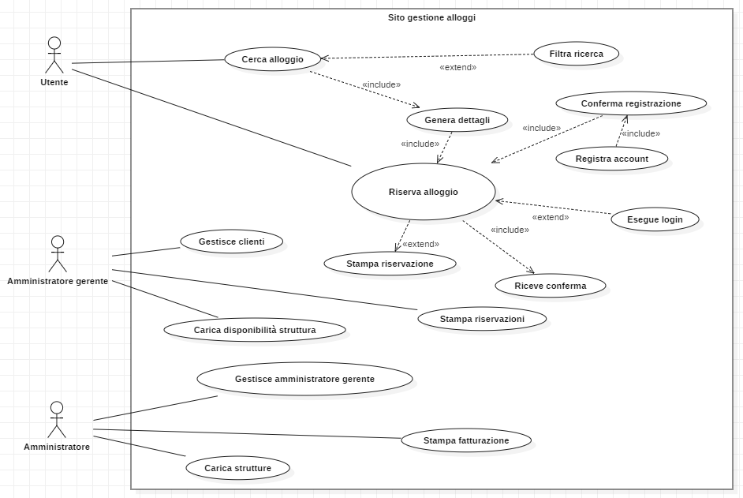

# Gestione alloggi | Diario di lavoro - 12.09.2019

##### Mattia Lazzaroni

### Canobbio, 12.09.2019

## Lavori svolti
| Orario        | Lavori svolti   |
| ------------- | --------------- |
| 13:15 - 14:45 | Durante le prime due ore della giornata di oggi ho realizzato lo use case del sito. Questo è il risultato:   |
| 15:00 - 16:30 | Dopo la pausa mi sono concentrato sulla documentazione, in particolare ho sistemato la struttura generale e ho aggiunto la descrizione del Gantt e degli Use Case. In generale nella giornata di oggi ho finito l'analisi sulla documentazione. |

## Problemi riscontrati e soluzioni adottate
Nessun problema riscontrato.

## Punto della situazione rispetto alla pianificazione
In ritardo rispetto alla pianificazione, in quanto dovrei essere nel mezzo della progettazione ma ho appena finito l'analisi.

## Programma di massima per la prossima giornata di lavoro
Nella prossima giornata di lavoro inizierò la progettazione, a partire dal design dell'architettura.

