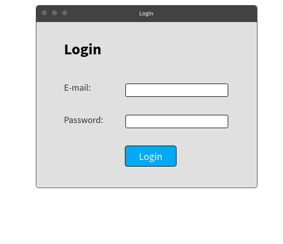

# Gestione alloggi | Diario di lavoro - 19.09.2019

##### Mattia Lazzaroni

### Canobbio, 19.09.2019

## Lavori svolti
| Orario        | Lavori svolti   |
| ------------- | --------------- |
| 13:15 - 14:45 | Iniziata la lezione, sono andato a controllare le risposte del docente responsabile alle domande postegli durante la scorsa lezione. Sono andato dunque a modificare il database secondo le sue specifiche ed ho eliminato il database inutile. In seguito sono incappato in un problema con il tool "GitHub Desktop" che non mi permetteva di pullare da GitHub e ho perso molto tempo online per trovare una soluzione che non ho trovato. Ho poi sistemato il problema semplicemente riavviando il computer. |
| 14:45 - 15:00 | Durante la pausa mi sono recato dal docente responsabile per porgli qualche domanda riguardo l'integrazione della tabella "Fattura" all'interno del database e riguardo la creazione dello script per l'inserimento degli alloggi. |
| 15:00 - 16:30 | Dopo la pausa ho iniziato il design delle interfacce. Prima di tutto ho dovuto investire del tempo per imparare ad usare il sito WireFrame per poter realizzare i design. Per oggi ho realizzato le interfacce per la registrazione e per il login.   |

## Problemi riscontrati e soluzioni adottate
Nessun problema riscontrato.

## Punto della situazione rispetto alla pianificazione
In ritardo rispetto alla pianificazione, in quanto dovrei essere in fase di implementazione ma sono ancora in fase di design.

## Programma di massima per la prossima giornata di lavoro
Nella prossima giornata di lavoro terminierò il design del secondo database, se il mio responsabile lo riterrà necessario, altrimenti comincerò il design delle interfacce.

