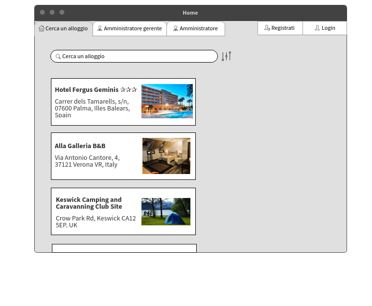
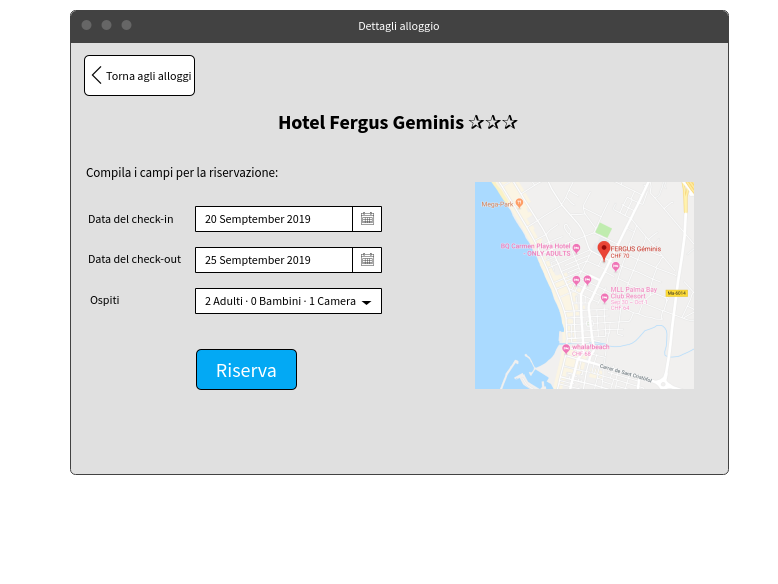

# Gestione alloggi | Diario di lavoro - 20.09.2019

##### Mattia Lazzaroni

### Canobbio, 20.09.2019

## Lavori svolti
| Orario        | Lavori svolti   |
| ------------- | --------------- |
| 13:15 - 14:45 | Nel corso delle prime due ore ho realizzato solamente il mockup della homepage.  |
| 15:00 - 16:30 | Dopo la pausa ho invece realizzato il mockup della pagina di dettaglio di un alloggio. Questo è quanto ho fatto per ora:  Alla fine della lezione ho inserito tutti i mockups nella documentazione con le relative didascalie. |

## Problemi riscontrati e soluzioni adottate
Nessun problema riscontrato.

## Punto della situazione rispetto alla pianificazione
In ritardo rispetto alla pianificazione, in quanto dovrei essere in fase di implementazione ma sono ancora in fase di design.

## Programma di massima per la prossima giornata di lavoro
Nella prossima giornata di lavoro terminierò il design delle interfacce e magari comincerò già l'implementazione.

