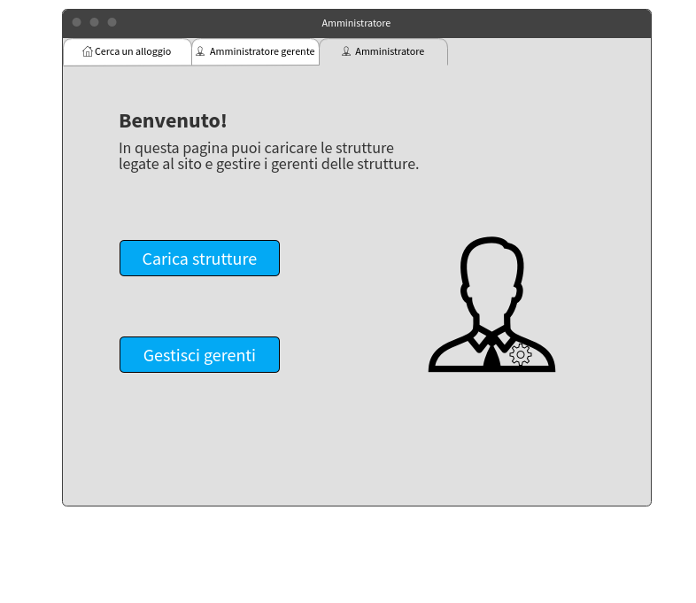

# Gestione alloggi | Diario di lavoro - 24.09.2019

##### Mattia Lazzaroni

### Canobbio, 24.09.2019

## Lavori svolti
| Orario        | Lavori svolti   |
| ------------- | --------------- |
| 13:15 - 14:45 | Nelle due ore prima della pausa ho inizialmente lavorato sulla documentazione, sistemando alcune cose e inserendo le descrizioni dei mockups della scorsa lezione. Dopo di questo sono andato a progettare gli ultimi 2 mockups: quello per la pagina degli amministratori gerenti e quello per la pagina degli amministratori. Questi sono i risultati:  |
| 15:00 - 16:30 | Dopo la pausa ho iniziato a lavorare sull'implementazione, in particolare sulla creazione del Database. Prima di questo ho dovuo però installare MySQL Workbench, attività che mi ha preso tanto tempo in quanto il servizio di mysql non era inizialmente in esecuzione e successivamente non mi permetteva di accedere con lo user 'root'@'localhost'. Sono quindi dovuto andare a modificare i privilegi di questo utente.  |

## Problemi riscontrati e soluzioni adottate
Nessun problema riscontrato.

## Punto della situazione rispetto alla pianificazione
In ritardo rispetto alla pianificazione, in quanto oggi dovrei avere finto i form di registrazione e di login, ma ho solamente creato il Database. Attenzione, l'ordine di implementazione era: form di registrazione, form di login e Database. Tuttavia, ho preferito realizzare prima il Database rispetto ai form. 

## Programma di massima per la prossima giornata di lavoro
Nella prossima giornata di lavoro invece di continuare con l'implementazione dovrò lavorare sulla documentazione per inserire le descrizioni del design del Database e dei mockups delle interfacce.

