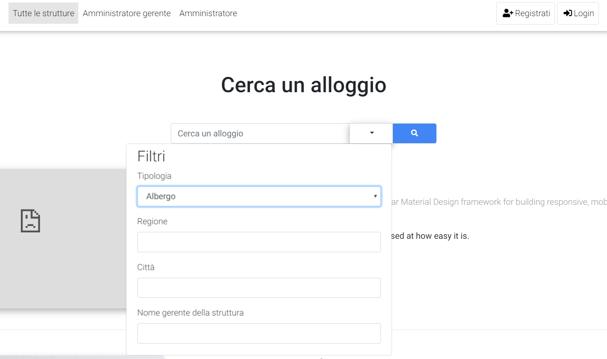

# Gestione alloggi | Diario di lavoro - 03.10.2019

##### Mattia Lazzaroni

### Canobbio, 03.10.2019

## Lavori svolti

| Orario        | Lavori svolti   |
| ------------- | --------------- |
| 13:15 - 14:15 | Nel corso delle prime due ore ho proceduto solamente con l'implementazione della homepage, questo è quanto ho realizzato fino ad ora:|
| 14:15 - 16:30 | Dopo la pausa ho iniziato a creare la pagina di registrazione e di login. Nell'ultima mezz'ora ho dovuto configurare il Web Server per poter utilizzare php nel progetto. Per farlo ho modificato la DocumentRoot in httpd.conf indicando la cartella contenente il codice: 
```conf
DocumentRoot "C:\Users\matti\OneDrive\Desktop\Progetti individuali\Gestione alloggi\Implementazione\Boostrap-4-template-one-column-listing\one-column-listing" 

<Directory "C:\Users\matti\OneDrive\Desktop\Progetti individuali\Gestione alloggi\Implementazione\Boostrap-4-template-one-column-listing\one-column-listing">
```

## Problemi riscontrati e soluzioni adottate
Nessun problema riscontrato

## Punto della situazione rispetto alla pianificazione
In ritardo rispetto alla pianificazione, in quanto oggi dovrei aver terminato la pagina di login e di registrazione, il database e dovrei essere in fase di realizzazione del menu degli amministratori, tuttavia ho terminato solo il database e un pezzo della homepage.

## Programma di massima per la prossima giornata di lavoro
Nella prossima giornata di lavoro proverò a terminare il form di login e di registrazione e se dovesse avanzare del tempo comincerò il menu degli amministraatori.
